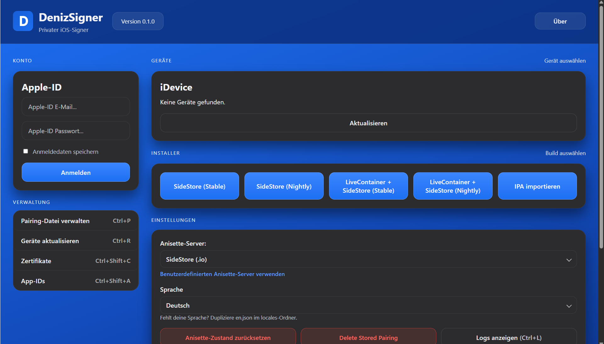

# DenizSigner

**Private iOS Sideloading & Signing Tool for Windows**

> A privacy-first, local-first desktop application for signing and sideloading
> IPAs to your personal iPhone or iPad.

```text
                         D
                    DenizSigner

       Private iOS Sideloading & Signing

     Local-first • Privacy-focused • Windows
```

[](https://github.com/LaFAirs/DenizSigner/actions/workflows/build.yml)
[](https://github.com/LaFAirs/DenizSigner/releases/latest)
[](https://github.com/LaFAirs/DenizSigner/releases)
[](#download)
[](https://tauri.app)
[](https://react.dev)
[](https://www.rust-lang.org)
[](https://www.typescriptlang.org)
[](LICENSE)

## Download

**Latest Release:** [LaFAirs/DenizSigner — Releases](https://github.com/LaFAirs/DenizSigner/releases/latest)

| File | Use |
| ---- | --- |
| `DenizSigner_*_x64-setup.exe` | Installer — **recommended** |
| `DenizSigner_*_x64_en-US.msi` | MSI installer (managed environments) |
| `denizsigner.exe` | Portable, runs without install |

> Only download from the official release page above. Windows SmartScreen
> may warn because the build is unsigned — that is expected for v0.1.0.

## Interface



More screens live under [`docs/screenshots/`](docs/screenshots/):

```text
docs/screenshots/
├── home.png       # main screen (Account, Devices, Installers, Settings)
├── device.png     # connected iPhone (pending real-device capture)
├── signing.png    # signing/install progress (pending real-device capture)
├── settings.png   # settings detail (pending capture)
└── privacy.png    # privacy / network section (pending capture)
```

Only real captures are committed — no mockups.

## Features

### Sideloading

- IPA import via file picker and drag & drop
- iPhone / iPad detection over USB (usbmuxd / lockdown, local only)
- Installation progress per step with friendly errors + technical details
- SideStore / LiveContainer one-click installers with pairing placement

### Signing

- Apple-ID authentication with 2FA flow and saved logins
- Development certificate management (list, inspect, revoke with confirmation)
- App ID management (list, quota display, delete with confirmation)
- Provisioning handled through your Apple developer session (free Apple IDs work)

### Device

- Pairing management: place, place-in-all, export (export asks first)
- Device info: name, iOS version, connection type
- Stored pairing cache per device (OS credential store)

### Privacy

- Local-first: no DenizSigner account, no registration, no cloud backend
- No analytics, no telemetry, no crash reporting, no auto-updater
- OS credential storage (Windows DPAPI / macOS Keychain), secrets redacted in logs
- Documented, enforced network allowlist (see below)

### Desktop

- Native Windows app (Tauri 2 + Rust backend, React + TypeScript UI)
- No console window in release builds
- English + German UI, keyboard shortcuts, log viewer with level filter

## Privacy by design

DenizSigner is designed to keep personal data local whenever possible.

| Data                | Stored locally        | Sent externally     |
| ------------------- | --------------------- | ------------------- |
| IPA files           | Yes                   | No*                 |
| Logs                | Yes (`logs/` folder)  | No                  |
| Credentials         | OS credential store   | No                  |
| Device information  | Yes                   | Only where required |
| Analytics           | None collected        | No                  |
| Telemetry           | None collected        | No                  |
| DenizSigner account | None exists           | None                |

`*` Apple services are required for the actual signing work: Apple-ID login,
developer session, certificates, and provisioning go to Apple (through the
open-source `isideload` component — there is no DenizSigner server in
between). Local IPA import needs no network at all.

Details: [`PRIVACY.md`](PRIVACY.md), [`SECURITY.md`](SECURITY.md).

## Network transparency

DenizSigner does not use a generic backend for telemetry or analytics.
Every outbound request the app itself makes is allowlisted in
`src-tauri/src/network_allowlist.rs` and audited by CI
(`scripts/audit-network.ps1`).

| Service | Purpose | Required |
| ------- | ------- | -------- |
| Apple services (via `isideload`) | Apple-ID auth, developer session, certificates, App IDs, signing | Yes |
| Anisette server of your choice (default `ani.sidestore.io`) | Apple-auth helper headers | Yes |
| `github.com` + release asset hosts | SideStore/LiveContainer IPAs you explicitly install | Only on click |
| `iforgot.apple.com`, `apple.co` | Help links, opened in your browser | Only on click |

Removed relative to the upstream reference: auto-updater + manifest endpoint,
download counter, community/support links. Device-local traffic
(usbmuxd/lockdown/AFC over USB) never leaves your machine.

## Security

Security-related design decisions:

- OS credential storage (DPAPI / Keychain, service `denizsigner`)
- Secret redaction before any log sink (`logging::redact`, unit-tested)
- Central network allowlist, `https` only, validated Anisette hosts
- Restricted Tauri permissions (no fs/shell/http plugins, no updater)
- No hardcoded credentials, no `.env` secrets (CI-gated)
- Explicit confirmations before revoke / delete / reset
- Local-first storage under the platform app-data directory

**Report a vulnerability:** please use a private channel — GitHub
[Security Advisories](https://github.com/LaFAirs/DenizSigner/security/advisories)
(`Security` → `Report a vulnerability`). Never paste passwords, 2FA codes,
or tokens into public issues. See [`SECURITY.md`](SECURITY.md) for the full
policy (scope, response time, safe handling).

## Installation

### Windows

1. Download the [latest release](https://github.com/LaFAirs/DenizSigner/releases/latest)
   (`DenizSigner_*_x64-setup.exe` recommended).
2. Run the installer. (SmartScreen may warn because the build is unsigned —
   only proceed if you downloaded it from the official release page above.)
3. Install **Apple Devices** (or iTunes) from the Microsoft Store if your
   iPhone is not detected — Windows needs Apple's USB drivers.
4. Connect your iPhone/iPad via USB, unlock it, tap **Trust**.
5. Open DenizSigner, select the device, sign in with your Apple ID.

### Requirements

- Windows 10 (1809+) / 11 x64
- WebView2 Runtime (preinstalled on current Windows)
- Apple Devices app or iTunes (USB drivers)
- USB connection, iPhone/iPad
- Apple ID for signing (a free Apple ID works)

## Quick Start

```text
1. Connect your iPhone
2. Open DenizSigner
3. Pair the device (select it, tap Trust)
4. Choose an IPA (Import IPA or drag & drop)
5. Sign in with your Apple ID when asked
6. Install and watch the step progress
7. Launch the app on your device
```

## Architecture

```text
React / TypeScript
        ↓
     Tauri 2
        ↓
      Rust
        ↓
 ┌──────┼─────────┐
 │      │         │
IPA   Signing   Device
 │      │         │
 └──────┼─────────┘
        ↓
 iPhone / iPad
```

- **Frontend** (`src/`): iloader-style workspace — account, device,
  installers, settings, pairing/certificates/App-ID dialogs, operation
  progress, log viewer. No network calls except Tauri commands.
- **Backend** (`src-tauri/src/`): 24 narrow Tauri commands — Apple login
  (2FA via window events), certificates, App IDs, usbmuxd device handling,
  lockdown/remote pairing, validated sideload, allowlist-gated downloads.
- **Device layer**: `idevice` (USB/lockdown/AFC) + `isideload`
  (Apple auth/developer/signing). No DenizSigner servers involved.

Full reference: [`ARCHITECTURE.md`](ARCHITECTURE.md).

## Project Structure

```text
DenizSigner/
├── src/                 # React + TypeScript UI
├── src-tauri/           # Rust backend (Tauri 2)
├── public/              # D logo and static assets
├── scripts/             # audit-network, check-branding, frontend tests
├── docs/
│   └── screenshots/     # real UI captures
├── .github/
│   └── workflows/       # build + release CI
├── ARCHITECTURE.md
├── PRIVACY.md
├── SECURITY.md
├── NOTICE.md
├── CHANGELOG.md
└── README.md
```

## Development

```bash
npm install
npm run tauri dev
```

Tests (all must be green):

```bash
npx tsc --noEmit
npm run build
npm test
cd src-tauri
cargo test
```

Audits:

```powershell
powershell -ExecutionPolicy Bypass -File scripts/audit-network.ps1
powershell -ExecutionPolicy Bypass -File scripts/check-branding.ps1
```

Release build: `npm run tauri build` → `.exe` + `-setup.exe` + `.msi`
under `src-tauri/target/release/bundle/`. Icons:
`npx tauri icon src-tauri/icons/icon.svg`.

## GitHub Actions

| Workflow | Trigger | Purpose |
| -------- | ------- | ------- |
| `build.yml` | push / PR | tsc, vite build, frontend tests, both audits, `cargo test`, no-secrets gate |
| `release.yml` | version tag (`v*`) | Tauri release build, `.exe` + `.msi` + checksums to GitHub Release |

Relevant tests run on every pull request; the release pipeline only runs on tags.

## Release Workflow

```text
Development
    ↓
Tests (tsc, frontend, cargo, audits)
    ↓
Security Audit (secrets, permissions, allowlist)
    ↓
Release Build (local verification + screenshots)
    ↓
Git Tag (vX.Y.Z)
    ↓
GitHub Release (CI build with `.exe`, `-setup.exe`, `.msi`)
```

Release files: portable `.exe`, NSIS `-setup.exe`, `.msi`.

## Troubleshooting

- **No devices found** — install Apple Devices/iTunes, use USB (not Wi-Fi),
  unlock the device, accept Trust, try another port/cable, press Refresh.
- **Sign-in fails** — check Apple ID + password + 2FA code; unlock a locked
  account at `iforgot.apple.com` first.
- **Anisette errors** — check the connection, try another Anisette server in
  Settings, open the server URL in a browser to test reachability.
- **Pairing fails** — keep the device unlocked, tap Trust, re-select it.
- **Keyring unavailable** — Settings explains the insecure-disk fallback;
  only enable it if the OS store genuinely fails.
- **Installation rejected** — free Apple IDs allow 3 apps / 10 App IDs per
  7 days; remove unused apps or wait for expiry.
- Still stuck? Settings → View Logs, copy the entry, open an issue —
  without passwords, codes, or tokens.

## Known limitations

- **No physical-device testing in this build.** Device detection, pairing,
  signing, and installation are implemented and unit-tested, but have not
  been verified against a real iPhone in this build.
- **Unsigned Windows build.** SmartScreen warns on first launch; verify the
  checksum, then allow the app explicitly.
- **Free Apple IDs** are limited by Apple (3 sideloaded apps, 10 App IDs per
  7 days) — a platform restriction, not an app bug.
- **German translations** may lag behind new English strings; missing keys
  fall back to English automatically.
- Minimum window size is 560×480; below ~768 px the layout stacks vertically.

## Roadmap

### v0.1.x

- Stabilization and bug fixes
- Better device diagnostics (clearer usbmuxd/pairing errors)

### v0.2.x

- Improved signing workflow
- Better error messages with actionable guidance
- More device information where technically available

### Future (evaluating)

- macOS support (Keychain path already exists in code)
- Additional device workflows
- Improved automation without background polling

## License

MIT

See LICENSE for details.

## Credits

Built with Tauri, React, Rust and open-source iOS device/signing components.

See NOTICE.md for third-party acknowledgements.
